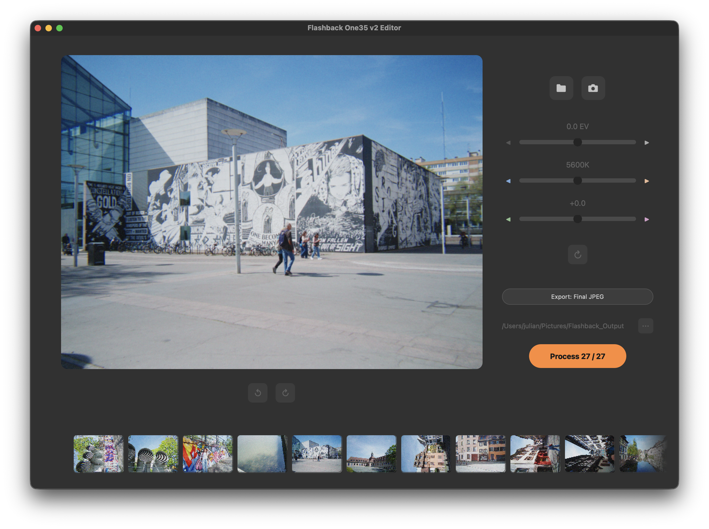
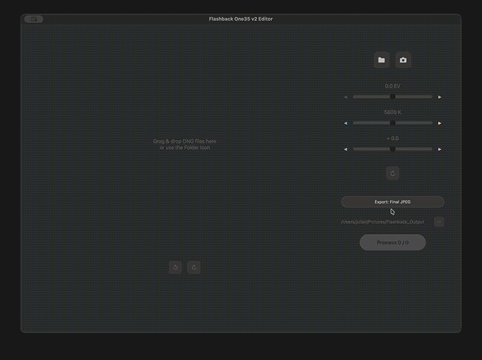

# Flashback One35 v2 Editor

A dedicated RAW processor and editor built specifically for the [Flashback One35 v2](https:///joinflashback.co) camera.

This app processes Flashback One35 v2 RAW files through a custom color pipeline and film emulation.

---

## Download

Get the latest release for your platform from the [Releases](../../releases/latest) page.

| Platform | Status |
|----------|--------|
| [macOS (Apple Silicon)](https://github.com/lofilogic/flashback-raw-editor/releases/download/v0.1.0-beta9/Flashback-macOS.zip) | ✓ Tested |
| [Windows](https://github.com/lofilogic/flashback-raw-editor/releases/download/v0.1.0-beta9/Flashback-Windows.zip) | ✓ Tested |
| [Linux x86_64](https://github.com/lofilogic/flashback-raw-editor/releases/download/v0.1.0-beta9/Flashback-Linux.zip) | ⚠ Untested — binary provided, feedback welcome |

### macOS
1. Download `Flashback-macOS.zip` and unzip it
2. Move `Flashback One35 v2.app` to your Applications folder
3. On first launch, right-click → Open (macOS Gatekeeper requires this for unsigned apps)

### Windows
1. Download `Flashback-Windows.zip` and unzip it
2. Run `Flashback One35.exe` from the extracted folder

### Linux
1. Download `Flashback-Linux.zip` and unzip it
2. Make the binary executable: `chmod +x "Flashback One35"`
3. Run it: `./"Flashback One35"`

---

## Features

- **Custom color pipeline** — sensor-specific CCM, white balance, and LUT tuned for the One35 v2
- **Film emulation effects** — halation, chromatic aberration, softness, and grain
- **Batch export** — queue and process multiple images to JPEG in one go
- **Zen mode** — hide controls for a clean full-screen view of your image
- **Drag & drop** — drop DNG files or folders directly onto the app
- **Camera detection** — auto-detects the One35 v2 when connected via USB

---

## How to Use

### Basic workflow
1. Open a folder of DNGs via the folder icon, drag & drop, or connect your camera (right after shooting, before developing inside the official Flashback app)
2. Browse images in the thumbnail strip at the bottom
3. Adjust **Exposure**, **White Balance**, and **Tint** with the sliders
4. Set your export folder and click **Process** to export JPEGs
5. Alternatively export 16-bit tif-intermediates to quickly reprocess later

### Controls

**Preview**
- `Scroll / Left-click` — zoom
- `Left-click + drag` — pan (when zoomed in)
- `Double-click` — fit to screen (when zoomed in)

**Thumbnail strip**
- `← / → arrow keys` — navigate images
- `Right-click` — queue / unqueue images (for batch processing)
- `Shift + Left-click` — select (to paste settings)
- `Cmd/Ctrl + click` — select individual images (to paste settings)

**Adjustments**
- `Double-click` any slider — reset to default
- `Cmd/Ctrl + C` — copy settings from current image
- `Cmd/Ctrl + V` — paste settings to selected images

**Zen mode**
- Click the zen mode button to hide all controls and show only the image

- `⛶ button` — Enter Zen mode
- `Escape` — exit Zen mode

- `← / → arrow keys` — navigate images
- `↑ / ↓ arrow keys` — rotate images

`Left-click + drag up/down` — Exposure
`Left-click + drag left/right` — White Balance
`Right-click + drag left/right` — Tint

---

## License

GPL v3 — see [LICENSE](LICENSE) for details.
