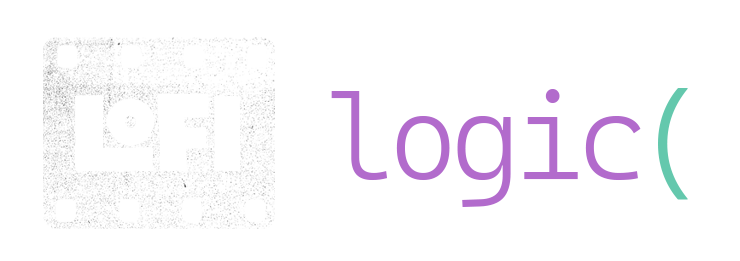
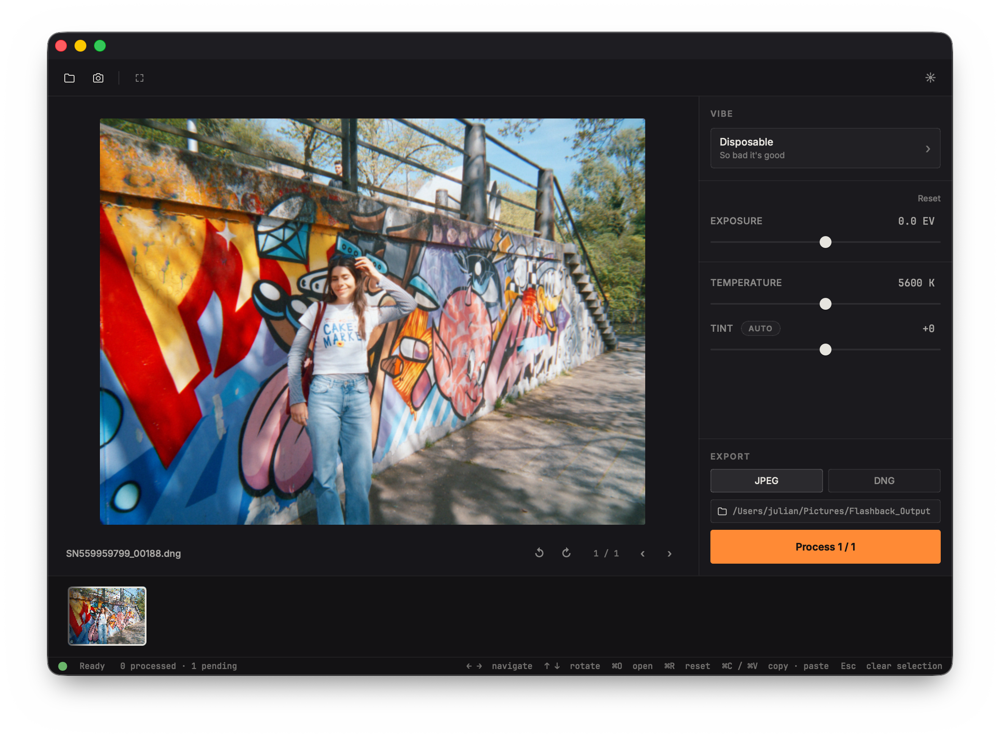
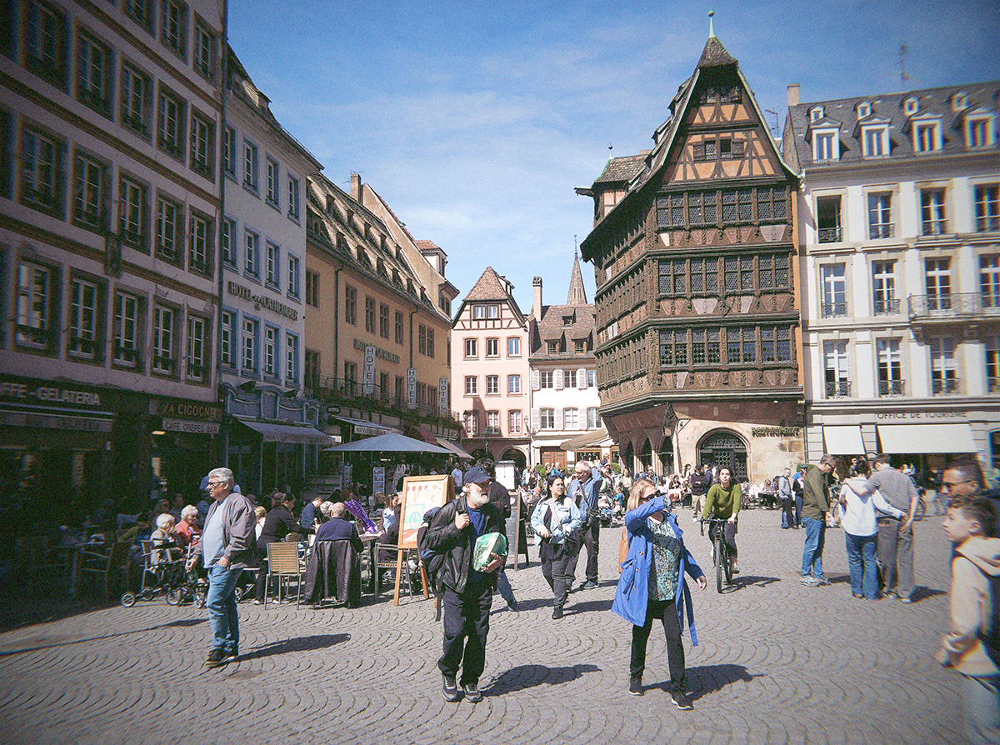
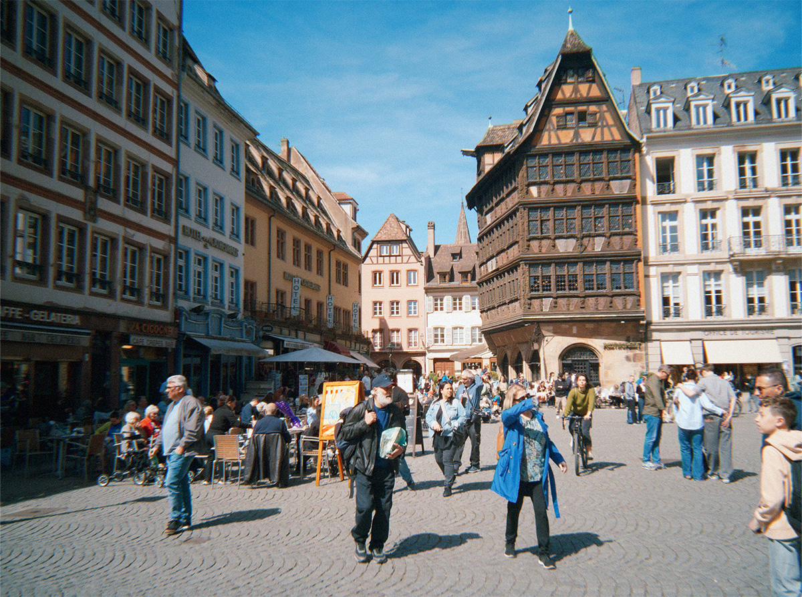
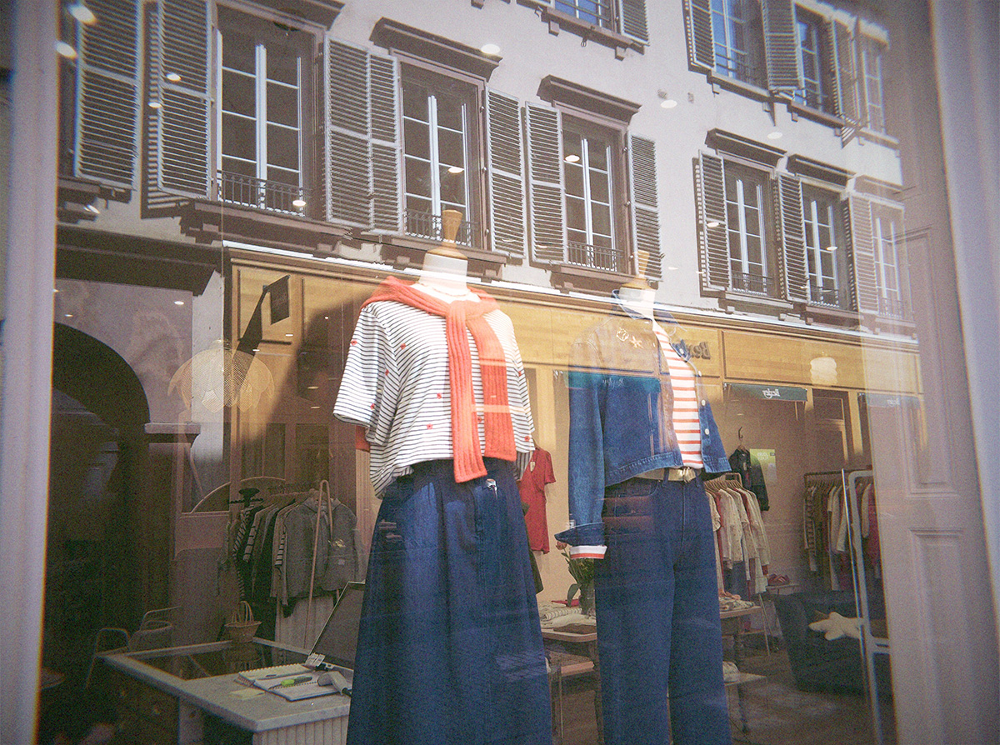
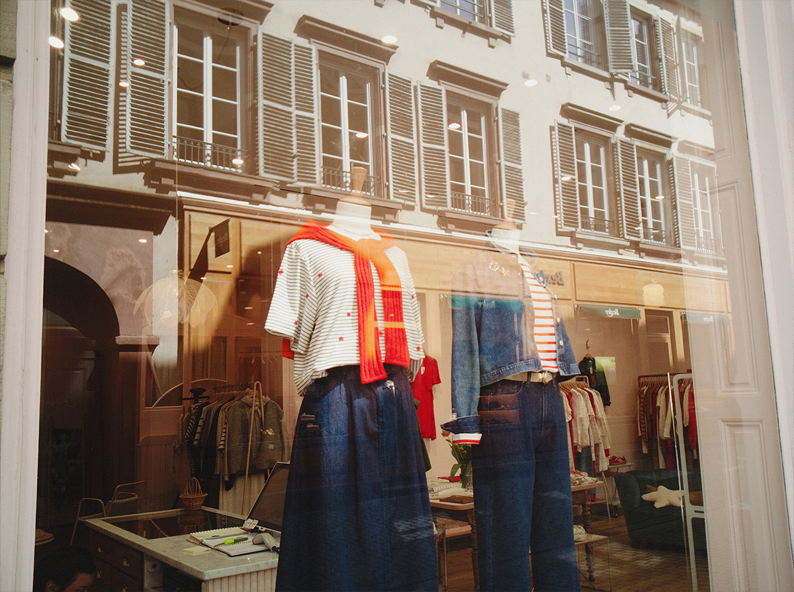
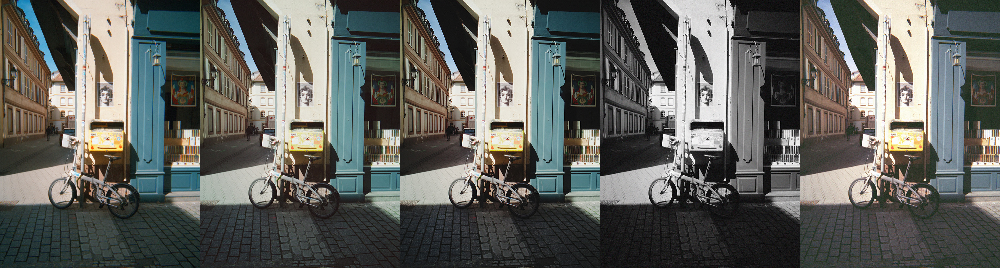
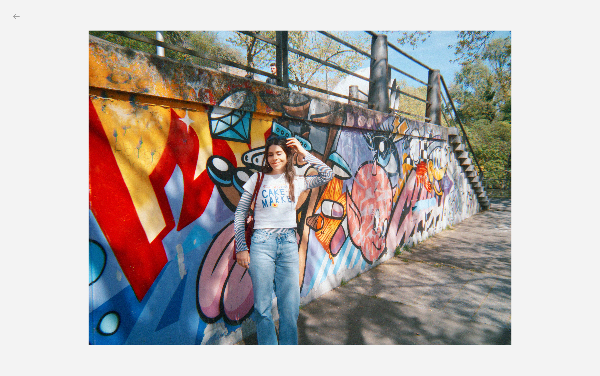

<div align="center">



A RAW editor for the [**Flashback Camera**](https://joinflashback.co) —
authentic film colour, emulation effects, and batch-fast editing.

[](../../releases/latest)
[](#download--install)
[](LICENSE)



</div>

---

## What it is

LoFi Logic develops your Flashback RAWs through a custom colour pipeline and a film-emulation
stack (halation, bloom, grain, softness, vignette) and lets you apply a look to a whole
roll in one pass. It's built to be quick and to get out of your way: set a vibe, adjust a few
sliders, export the keepers.

**What it works with, in order of how much it's tuned for them:**

1. **Flashback One35 V2:** the primary target. Full colour pipeline, camera-matched profile.
2. **Flashback One35 (V1):** support via the negative export (see below).
3. **Most other RAW files:** Canon, Nikon, Sony, Fujifilm, and friends open through a generic
   pipeline. They develop fine and take the vibes, but the colour is a best-effort match, not a
   camera-specific calibration — don't expect every body to land in exactly the same place.

---

## The look

Each **vibe** is a complete film recipe: colour, halation, grain, the good stuff. Here's the same
frame as the official Flashback app renders it, next to a couple of LoFi Logic vibes:

<div align="center">

<table>
<tr>
<td align="center"><br><sub>Flashback app</sub></td>
<td align="center"><br><sub><b>Disposable</b></sub></td>
</tr>
<tr>
<td align="center"><br><sub>Flashback app</sub></td>
<td align="center"><br><sub><b>Rangefinder</b></sub></td>
</tr>
</table>

</div>

Switch the whole look with `1`–`5`:

<div align="center">



<sub><b>Disposable</b> · <b>Point &amp; Shoot</b> · <b>Rangefinder</b> · <b>Monochrome</b> · <b>Flashback Classic (V1)</b></sub>

</div>

---

## Getting your photos in

Both cameras follow the same idea: import the RAWs, set a vibe, batch export, keep the good
ones. They differ only in how the files come off the camera.

### Flashback One35 V2

Shoot a roll. **Before** you develop it in the official Flashback app (which clears the DNGs
off the camera) plug the One35 V2 in over USB. LoFi Logic copies the RAWs to disk
(default: `~/Pictures/LoFi_Logic`), then it's: pick a vibe, adjust, batch export. Drop the
duds; save the project if you want to pick it back up later.

> Develop in the official app *after* importing here, not before. Otherwise the DNGs are gone.

### Flashback One35 (V1)

The V1 can't write DNGs, so it goes through the negative export instead:

1. Develop the roll in the official Flashback app.
2. In the gallery, **Share → Export negatives**. You get a `.zip`.
3. Drag that `.zip` straight onto LoFi Logic, or **File → Open**.

It unpacks the negatives to disk (default: `~/Pictures/LoFi_Logic`), and from there it's the
same flow: vibe, adjust, batch export, ditch the duds, save the project.

> 📱 Official Flashback app: [iOS](https://apps.apple.com/app/flashback-camera/id1601362087) · [Android](https://play.google.com/store/apps/details?id=co.joinflashback.android)

---

## Zen mode

A distraction-free, full-screen view with the controls hidden, like your favorite film-photography youtube videos. Adjustments
move to mouse gestures, so you can dial in exposure and white balance without hunting for a
slider.

<div align="center">

</div>

| Input | Action |
|-------|--------|
| `Left-drag ↕` | Exposure |
| `Left-drag ↔` | White balance |
| `Right-drag ↔` | Tint |
| `← / →` | Navigate · `↑ / ↓` rotate |
| `Escape` | Exit |

---

## Download & install

Grab the latest build for your platform from the [**Releases**](../../releases/latest) page.

| Platform | File | Status |
|----------|------|--------|
| macOS (Apple Silicon) | [`LoFiLogic-macOS-1.5.0.dmg`](https://github.com/lofilogic/flashback-raw-editor/releases/download/v1.5.0/LoFiLogic-macOS-1.5.0.dmg) | ✓ Tested |
| Windows (x64) | [`LoFiLogic-Windows-Setup-1.5.0.exe`](https://github.com/lofilogic/flashback-raw-editor/releases/download/v1.5.0/LoFiLogic-Windows-Setup-1.5.0.exe) | ✓ Tested |
| Linux (x86_64) | [`LoFiLogic-Linux-1.5.0.AppImage`](https://github.com/lofilogic/flashback-raw-editor/releases/download/v1.5.0/LoFiLogic-Linux-1.5.0.AppImage) | ⚠ Community-tested |

The apps aren't code-signed yet, so each OS warns on first launch. One-time steps:

<details>
<summary><b>macOS</b></summary>

1. Open the `.dmg` and drag the app into Applications.
2. First launch is blocked because the app isn't signed:
   - Double-click — macOS refuses and shows a warning.
   - **System Settings → Privacy & Security**, scroll to the *"…was blocked"* notice.
   - Click **Open Anyway** and confirm. Once only.
</details>

<details>
<summary><b>Windows</b></summary>

1. Run the installer.
2. If SmartScreen shows *"Windows protected your PC"*: **More info → Run anyway**.
3. Finish the installer — it adds a Start Menu entry and an optional desktop shortcut.
</details>

<details>
<summary><b>Linux</b></summary>

```bash
chmod +x LoFiLogic-Linux.AppImage
./LoFiLogic-Linux.AppImage
```

FUSE error? Install it (`sudo apt install libfuse2`) or extract and run:

```bash
./LoFiLogic-Linux.AppImage --appimage-extract
./squashfs-root/AppRun
```

> If you see an orange **"GPU not detected"** banner, renders will be slow — update your
> graphics drivers. It still works on the CPU fallback in the meantime.
</details>

---

## Controls

<details open>
<summary><b>Preview</b></summary>

| Input | Action |
|-------|--------|
| `Scroll` / `Left-click` | Zoom |
| `Left-click + drag` | Pan (when zoomed) |
| `Double-click` | Fit to screen |
| `1`–`5` | Select vibe |
</details>

<details>
<summary><b>Thumbnail strip</b></summary>

| Input | Action |
|-------|--------|
| `← / →` | Navigate images |
| `Right-click` | Queue / unqueue for batch export |
| `Shift + click` | Range-select (to paste settings) |
| `Cmd/Ctrl + click` | Multi-select (to paste settings) |
</details>

<details>
<summary><b>Adjustments</b></summary>

| Input | Action |
|-------|--------|
| `Double-click` a slider | Reset to default |
| `Cmd/Ctrl + C` | Copy settings from current image |
| `Cmd/Ctrl + V` | Paste settings to selected images |
| `auto-tint` | Auto-compensate tint for a consistent look |
</details>

---

## For developers

A PySide6 app with a GPU-resident (wgpu / WebGPU) image pipeline, each stage backed by a
numpy/cv2 reference implementation.

- **[Architecture](docs/ARCHITECTURE.md)** — the colour pipeline, GPU-resident design, V1/V2 support, and why film-like low acuity is the point.
- **[Development](docs/DEVELOPMENT.md)** — build from source, run, test, and package.

---

## License

[GPL-3.0](LICENSE). Not affiliated with Flashback — an independent tool for One35 shooters,
made by [LoFi Logic](https://github.com/lofilogic).
