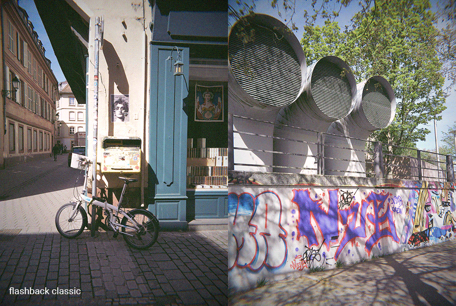

# Flashback One35 v2 Editor

A dedicated RAW processor and editor built specifically for the [Flashback One35 v2](https:///joinflashback.co) camera.


This app processes Flashback One35 v2 RAW files through a custom color pipeline and film emulation.



---

## Download

Get the latest release for your platform from the [Releases](../../releases/latest) page.

| Platform | Download | Status |
|----------|----------|--------|
| macOS (Apple Silicon) | [`Flashback-macOS.dmg`](https://github.com/lofilogic/flashback-raw-editor/releases/download/v0.1.0-rc2/Flashback-macOS.dmg) | ✓ Tested |
| Windows | [`Flashback-Windows-Setup.exe`](https://github.com/lofilogic/flashback-raw-editor/releases/download/v0.1.0-rc2/Flashback-Windows-Setup.exe) | ✓ Tested |
| Linux x86_64 | [`Flashback-Linux.AppImage`](https://github.com/lofilogic/flashback-raw-editor/releases/download/v0.1.0-rc2/Flashback-Linux.AppImage) | ⚠ Untested — feedback welcome |

### macOS
1. Open `Flashback-macOS.dmg`
2. Drag **Flashback One35** into your Applications folder
3. On first launch, macOS will block the app because it isn't signed. To open it:
   - Double-click the app — macOS will show a warning and refuse to open it
   - Go to **System Settings → Privacy & Security**
   - Scroll down — you'll see *"Flashback One35 v2 was blocked"*
   - Click **Open Anyway** and confirm

   You only need to do this once.

### Windows
1. Run `Flashback-Windows-Setup.exe`
2. If SmartScreen shows "Windows protected your PC" (the app is not yet code-signed):
   - Click **More info**
   - Click **Run anyway**
3. Follow the installer — it will create a Start Menu entry and optional desktop shortcut

### Linux
1. Download `Flashback-Linux.AppImage`
2. Make it executable and run:
   ```
   chmod +x Flashback-Linux.AppImage
   ./Flashback-Linux.AppImage
   ```
3. If you get a FUSE error, either install it (`sudo apt install libfuse2`) or extract and run directly:
   ```
   ./Flashback-Linux.AppImage --appimage-extract
   ./squashfs-root/AppRun
   ```

---

## Features

- **Custom color pipeline** — sensor-specific CCM, white balance, and LUT tuned for the One35 v2
- **Film emulation effects** — halation, chromatic aberration, softness, and grain
- **Batch export** — queue and process multiple images to JPEG in one go
- **Zen mode** — hide controls for a clean full-screen view of your image
- **Drag & drop** — drop DNG files or folders directly onto the app
- **Camera detection** — auto-detects the One35 v2 when connected via USB

---

## How to Use


### Basic workflow
1. Open a folder of DNGs via the folder icon, drag & drop, or connect your camera (right after shooting, before developing inside the official Flashback app)
2. Browse images in the thumbnail strip at the bottom
3. Adjust **Exposure**, **White Balance**, and **Tint** with the sliders
4. Set your export folder and click **Process** to export JPEGs
5. Alternatively export 16-bit tif-intermediates to quickly reprocess later

### Controls

**Preview**
- `Scroll / Left-click` — zoom
- `Left-click + drag` — pan (when zoomed in)
- `Double-click` — fit to screen (when zoomed in)

**Thumbnail strip**
- `← / → arrow keys` — navigate images
- `Right-click` — queue / unqueue images (for batch processing)
- `Shift + Left-click` — select (to paste settings)
- `Cmd/Ctrl + click` — select individual images (to paste settings)

**Adjustments**
- `Double-click` any slider — reset to default
- `Cmd/Ctrl + C` — copy settings from current image
- `Cmd/Ctrl + V` — paste settings to selected images
- `auto-tint` - Keeps an aesthetic appearance by automatically compensating tint

**Zen mode**

Click the zen mode button to hide all controls and show only the image
- `⛶ button` — Enter Zen mode
- `Escape` — exit Zen mode
- `← / → arrow keys` — navigate images
- `↑ / ↓ arrow keys` — rotate images
- `Left-click + drag up/down` — Exposure
- `Left-click + drag left/right` — White Balance
- `Right-click + drag left/right` — Tint

---

## License

GPL v3 — see [LICENSE](LICENSE) for details.
